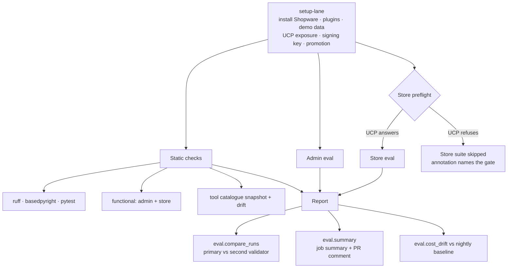
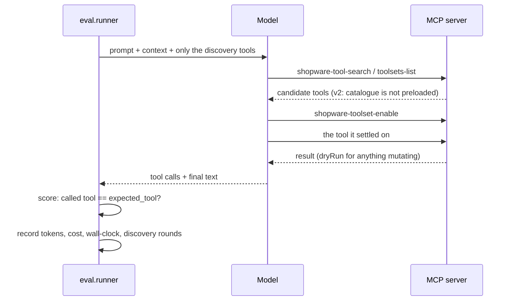

# shopware-mcp-evals

Test suite for the Shopware MCP server (**MCP Server v2**: dynamic tool
discovery), run against a live instance. Two layers: **functional** (Python,
no LLM, all mutating tools dryRun-safe) and **LLM eval** (Python, prompts →
tool selection accuracy).

See `README.md` for the full picture and motivation; this file is the short
brief for coding agents.

## How a run flows

The CI pipeline. `setup-lane` is the composite action every job shares, which is
why a mistake in it takes down suites that have nothing to do with each other.



One fixture, from prompt to verdict. The scoring rule is the part worth
remembering: **the tool the model called is compared against `expected_tool`, and
the discovery trail is recorded but not scored.**



## Conventions

- **Nothing consumes this repo, so there is almost no compatibility surface.**
  It is a test harness: no package is published, nothing imports it, there is no
  release and no downstream. Renaming a function, restructuring a module or
  redefining what `passed` means costs one thing — updating the callers in here.
  So don't spend effort on `BREAKING CHANGE:` trailers, `feat!:` titles,
  deprecation windows, aliases kept "for compatibility", or shims around our own
  code. Delete and move on.
  The one real exception is the **on-disk report schema**: `eval/compare_runs.py`
  and `eval/cost_drift.py` read reports from *earlier* runs (a cached nightly
  baseline, the files in `results/`), so a renamed or dropped result key breaks
  the comparison against history rather than a caller you can grep for. That is
  what `SCHEMA_VERSION` and the `.get()`-with-default reads in `eval/scoring.py`
  are for — add fields, tolerate their absence, and don't rename in place.
  None of this excuses the two things that do matter: a red build, and a
  threshold that has stopped measuring what it claims. When `passed` changed from
  "named the expected tool" to "the call ran and satisfied the fixture", the
  0.90/0.85 gates kept their numbers and silently stopped describing the same
  quantity. That is a real problem, and it is not a compatibility one — fix the
  gate, skip the ceremony.
- **No shell scripts for test logic.** Both layers are Python; the functional
  runner (`functional/runner.py`) reuses `mcp_client.py`. Don't add `.sh` runners —
  extend the Python runner or add a helper module. The shell that belongs here is
  CI glue under `functional/ci/*.sh` and the local-first entry point
  `scripts/trunk-lane.sh`, which sequences existing Python commands rather than
  implementing anything. Both trees are shellcheck-linted.
- **Add unit tests for new logic.** New functional / eval / client behavior gets
  a pytest test under `tests/` — offline, faking the MCP server (see the existing
  tests). CI runs `ruff` + `pytest` + `shellcheck` on every push, so keep them green.
- **Three prompts per tool, differing in kind.** Every tool needs at least three
  fixtures: a canonical phrasing, a paraphrase avoiding the tool's own
  vocabulary, and a boundary case set against a sibling tool. Restating one
  sentence three ways proves nothing — the goal is to catch a description that
  only works for one lucky wording. `tests/test_fixtures.py` enforces the count
  (plus id/prompt uniqueness and toolset correctness) against
  `tool-history/latest.json`, so a new server-side tool fails the unit tests
  until it has prompts.
- **Two workflows, and the heavy one is four jobs.** `lint.yml` is the fast gate
  (ruff + format + pytest + shellcheck) on every PR. `mcp-evals.yml` runs
  `static` → (`admin-eval`, `store-eval`) → `report`, each building its own lane
  via `.github/actions/setup-lane`. It installs Shopware at the pinned
  `shopware.sha` and checks the plugin repos out at their **default branch**, so
  plugin churn can turn a run red without a change here — except
  `agentic-commerce`, temporarily pinned to the #154 branch.
  The lane cannot be shared between jobs: it is a live MySQL plus a daemonised
  server. Each job pays ~140s for its own, in parallel. What that buys is a
  failure you can locate — one job failing no longer skips the rest, which used
  to make an admin fixture failure look like "the plugin is missing".
  The Store/UCP part runs by default; skip it with `run_store=false`.
- **Never let a job write state you care about.** `--allow-mutations` places a
  real order. CI sets it because the instance dies with the job; a developer's
  shop does not. If you add anything that commits, gate it the same way and
  record the skip rather than omitting it silently.
- **The eval workflow is opt-in on PRs.** It runs nightly and on
  `workflow_dispatch` unconditionally, but on a pull request only when the PR
  carries the **`run-evals`** label — it costs a Shopware install and real OpenAI
  credit, and most changes here are covered by `lint.yml`. Add the label to start
  a run; it then re-runs on each push while the label stays. Unlabelled PRs show
  the job as skipped rather than not appearing at all.
- **`openai` is the only working provider.** The repo has `OPENAI_API_KEY` and
  `PLUGINS_PAT`, no `ANTHROPIC_API_KEY`, so `eval_provider` is a one-option
  dropdown. The runner itself supports `--provider anthropic` and the workflow
  already passes the secret through — enabling it is adding the secret plus one
  line to the input's `options`.
- **One job summary, rendered once.** Each `eval/runner.py` invocation writes a
  JSON verdict row (`--summary-row`, `--suite-label`, `--advisory`) and the
  final `eval/summary.py` step renders every row, plus the cross-model
  comparison, into `GITHUB_STEP_SUMMARY`. Don't append markdown to the step
  summary from the runners: three processes appending cannot form one table,
  which is how the summary ended up as three one-row tables repeating each
  other's numbers, with an unlabelled Store row at the bottom.
  `compare_runs.py` still prints its full report (including the per-model rate
  table) to stdout for local use — only the CI render is centralized, and it
  drops the rates because `summary.py` already shows them per suite.
- **Attribute failures to a repository.** `ownership.py` maps a tool name to
  the codebase that owns it (core / dev-tools / merchant-tools /
  agentic-commerce) by longest-matching prefix, and core is gated on its own
  denominator so a core regression cannot be averaged away by clean plugin
  numbers. Add new prefixes there, not inline: `tests/test_ownership.py` fails
  when a tool in `tool-history/latest.json` matches none of them, which is the
  point — an unattributed tool would silently be filed under core.
- **Pin the tooling, range the runtime.** `eval/requirements.txt` keeps ranges
  (with major caps) so CI tests against current SDKs; `requirements-dev.txt`
  pins `ruff` exactly and bounds `pytest`. A linter release adds rules and
  turns CI red with no code change, which is not a failure worth having.

## v2 invariants (read before touching the runners)

- A fresh session advertises only **non-deferred** tools. Deferred tools hide
  until their toolset is enabled — but stay directly callable if allowlisted.
  The allowlist is the call boundary; advertising is not.
- `tools/list` is cursor-paginated — always walk `nextCursor` (see
  `mcp_tools_list_all`), never assume one page.
- The three meta-tools (`META_TOOLS` in `mcp_client.py`):
  `shopware-tool-search`, `shopware-toolsets-list`, `shopware-toolset-enable`.
- `shopware-toolset-enable` persists per `Mcp-Session-Id`. Discovery-mode eval
  therefore opens a **fresh session per fixture** so enablement can't leak.
- **A tool can fail while the transport succeeds.** UCP reports every failure as
  HTTP 200, no JSON-RPC error, `{"success": false}` in the body. Anything
  asserting on a tool call must go through `eval/assertions.py:inband_error`, or
  it is blind to the entire Store failure mode — which is exactly what happened
  to 27 admin checks for months.

## UCP: six gates before a tool runs

All defaults, none visible in any tool description, and each fails the whole
Store suite. In order of when they fire:

| gate | symptom | fix |
|---|---|---|
| **`APP_ENV`** | any UCP call → `internal: The tool call failed unexpectedly.` and REST 500 `Internal server error.` | **must not be `test`.** `TestAgentProfileFetcherCompilerPass` swaps the real HTTP profile fetcher for `StaticAgentProfileFetcher`, which throws `LogicException: No profile configured` unless a PHPUnit test called `setProfile()` on it. No configuration can fix this. |
| **exposure** | profile serves `{"services":{},"capabilities":{}}` | `active: true` + `mcp` in `enabledTransports`. **Not settable from the console** — see below |
| `signaturePolicy` | `Missing signature headers` | defaults to `strict`; `ucp:config:set --signature-policy=off` on a throwaway lane |
| `agentAllowlist` | `Agent profile host is not allowed` | falls back to the sales-channel domains; `--agent-allowlist=<host>` |
| `platformAllowlist` | `Platform profile host is not allowed` | falls back to the **host of the incoming request**; `--platform-allowlist=<host>` |
| plain http | `Plain http is only allowed when profile fetching development mode is enabled` | set `ucp_sdk.profile_fetching_development_mode: true` in `config/packages/`. The `SWAG_AGENTIC_COMMERCE_UCP_PROFILE_FETCHING_DEVELOPMENT_MODE` env var works only if it reaches the process serving the request — the daemonized server, the CLI and the runner are three different environments, so `.env.local` is not enough. `isLocalHost()` accepts `localhost`, `127.0.0.1`, `::1` and `.localhost` subdomains. |

### Exposure lives in the plugin's own table, not `system_config`

`UcpConfigService::getConfig($salesChannelId)` reads `$this->repository->find()`
and returns immediately when it finds a row. `system_config` is only a *legacy
fallback*, used when the table has no row and then migrated into it.

So on a fresh install — which always has a row — `system:config:set
SwagAgenticCommerce.config.active true` writes a row **nothing reads**, and
`system:config:get` reads it straight back, so the write looks like it worked.
This cost seven CI runs. A long-lived local instance behaves differently because
it *predates* the table: its legacy rows hit the fallback and were migrated in.

`ucp:config:set` writes through the service (correct store) but has **no option**
for `active`, `enabledTransports` or `enabledCapabilities`. The only console-free
path is the route the Administration uses:

```bash
curl -X PUT "$APP_URL/api/_admin/ucp/sales-channels/$SC_ID/config" \
  -H "Authorization: Bearer $TOKEN" -H 'Content-Type: application/json' \
  -d '{"active":true,
       "enabledTransports":["rest","a2a","embedded","mcp"],
       "enabledCapabilities":["catalog","cart","discount","checkout","order"]}'
```

`saveConfig` merges partial payloads, so this can set the Exposure subset and
leave signature policy and allowlists to `ucp:config:set`.

**Verify with `ucp:config:show`** (reads through the service) and by fetching
`/.well-known/ucp`. Never with `system:config:get` — it can report values the
application never sees. `debug:config ucp_sdk` is unusable with the plugin
installed: it dies with *"Adding definition to a compiled container is not
allowed"*.

### Diagnosing a UCP failure in CI

Hard-won and cheap to forget:

- **A single ANSI-coloured line anywhere in a job makes the whole log
  unretrievable through the REST API** (`the response contains terminal escape
  sequences`), and a *passing* job's log is not retrievable at all. Put facts in
  `::warning::`/`::notice::` annotations, and pass `--no-ansi` to every console
  command. Six runs were spent on diagnostics that could not be read.
- **The application log is not under `shopware/var/log` when the server runs under
  `symfony server:start`** — check `$HOME/.config/symfony-cli/log` too, and note
  that only `dev` reliably writes `var/log/dev.log`.
- **Both transports flatten every error.** MCP answers `internal` and REST
  answers `Internal server error.` with no `code` and no `severity`, so the
  message is the only signal. When it is anonymous, the fastest route is to patch
  `ExceptionListener`'s fallback branch to append `$throwable::class` and
  `getMessage()`; that is what identified `APP_ENV=test`.

Two more things that look like tool bugs and are not:

- **UCP resolves its config from the domain the request arrives at**, not from
  the `sw-access-key`. Measured: one key, one configured channel, answering OK
  through a registered domain and `Missing signature headers` through an
  unregistered one, because the unregistered host silently reads defaults.
- **The profile URI is fetched by the server, mid-request.** It must name a
  host:port *the server* can reach — a host-mapped port is not one. A failure
  there escapes as a bare `internal` with nothing logged: measured, a valid
  profile answers in ~0.16s and a 404 fails in ~0.19s with exactly that error.
  `eval/preflight.py` probes the URI and says which it is.

## Setup

```bash
cp .env.example .env   # fill in credentials
pip install -r eval/requirements.txt
pip install -e . --no-deps   # makes `from mcp_client import ...` resolve anywhere
# or use the included venv: source .venv/bin/activate
```

## Running tests

```bash
# Layer 0 — static: description checks over the committed catalogue snapshot.
# No server, no model, no tokens. Advisory: always exits 0.
python -m toollint

# Everything free, against a local trunk lane, before spending CI.
scripts/trunk-lane.sh
scripts/trunk-lane.sh --eval

# Registry: does the server's declared ACL agree with toolclass? Admin only —
# debug:mcp has no endpoint flag and lists no Store tools (shopware/shopware#18848).
bin/console debug:mcp --tools --no-ansi > /tmp/m.txt
python -m eval.registry_check --from-file /tmp/m.txt

# Can ONE tool actually run? ~1s, no model. Fails with a named cause, and on a
# store failure fetches the UCP profile URI to say whether it is one.
python -m eval.preflight --endpoint store

# Layer 1 — functional: v2 discovery mechanics + per-tool dryRun-safe calls
python -m functional.runner
python -m functional.runner --skip-media-upload
python -m functional.runner --skip-dev-tools

# Layer 2 — LLM eval. Discovery mode only: default surface + agentic meta-tool
# loop. There was a `baseline` mode (full catalogue, single shot); it was removed
# because it graded the first call without exempting the discovery meta-tools it
# had put in the catalogue, so 40 of its 42 failures were the model correctly
# calling shopware-toolsets-list. `--modes baseline` now errors with that reason.
.venv/bin/python3 -m eval.runner                          # Anthropic
.venv/bin/python3 -m eval.runner --provider openai        # OpenAI
.venv/bin/python3 -m eval.runner --provider github        # GitHub Models (free, needs GITHUB_TOKEN)
.venv/bin/python3 -m eval.runner --max-steps 8
.venv/bin/python3 -m eval.runner --discovery-concurrency 12  # 4 by default; CI disables the MCP rate limiter and uses 12
.venv/bin/python3 -m eval.runner --category disambiguation
.venv/bin/python3 -m eval.runner --id disambig_count_vs_search
.venv/bin/python3 -m eval.runner --no-system-prompt       # ad-hoc, skip system prompt
.venv/bin/python3 -m eval.runner --output results/x.json  # custom report path
.venv/bin/python3 -m eval.runner --triage                 # re-run ONLY the failures under
                                                          # the isolated + full arms.
                                                          # In CI: nightly, the `run-triage`
                                                          # PR label, or the `triage`
                                                          # workflow_dispatch input.

# Cost of a run vs the previous one, per fixture. Warns, never gates.
.venv/bin/python3 -m eval.cost_drift --current results/eval-primary.json \
                                     --previous baseline/eval-primary.json

# Snapshot the full catalogue for drift detection
.venv/bin/python3 eval/snapshot_tools.py --output tool-history/latest.json

# Store API / UCP endpoint (needs SW_SC_ACCESS_KEY = a sales-channel access key)
python -m functional.runner --endpoint store

# The UCP buyer journey. COMMITS: creates a cart and a checkout and PLACES A REAL
# ORDER. Disposable lanes only. Without the flag every step is skipped with that
# reason, and a test asserts no call escapes the guard.
python -m functional.runner --endpoint store --allow-mutations

# Gate the eval on what the static layer proved. A fixture whose expected tool
# failed is skipped WITH THAT REASON rather than graded, so a plugin bug is not
# charged to the model. An absent file grades everything.
.venv/bin/python3 -m eval.runner --endpoint store \
    --tool-health results/tool-health-store.json

# Which context prompts to send, named after the install each mirrors.
.venv/bin/python3 -m eval.runner --context-prompts core     # vanilla Shopware
.venv/bin/python3 -m eval.runner --context-prompts none     # the control arm

# A local model. Reads /v1/models to record which one actually answered.
.venv/bin/python3 -m eval.runner --provider lmstudio --discovery-concurrency 1

# Unit tests (offline, no server) — reporting, runner logic, throttle retry
.venv/bin/python3 -m pytest tests -q
.venv/bin/python3 -m pytest tests -q --cov   # enforces the 90% branch-coverage floor
```

> **Measured under the new definition of `passed`** (tool executed, result
> asserted, recovery allowed): primary **99%** (95/96, core 100%), second
> validator **88%** (84/96, core 88%). Both clear 0.90/0.85, so neither
> threshold moved.
>
> Getting there took one detour worth knowing about. Earlier runs read 95% and
> **79%**, and the spread was not the models: all five of the primary's failures
> and six of the validator's twenty were fixtures naming an id the lane could not
> supply — right tool picked, call refused. A `REBASELINE` flag was added to hold
> the validator's gate advisory while the number was re-derived; fixing the ids
> (see the `{placeholder}` rules in `eval/fixtures.yaml`) moved it 79% -> 88% and
> the flag was deleted without ever changing a verdict. The lesson is the
> ordering: find out what the number is measuring before deciding it is wrong.
>
> The store suite's 64% is a real finding, not a threshold problem: every UCP
> tool is unsafe to execute, so that suite is graded on selection alone, and its
> failures cluster on `order-get`/`checkout-get`. It is advisory, so it shows up
> as a red annotation on an otherwise green job.

**Gate: the primary must reach 90%, the second validator 85%.** Each gates
itself, and `compare_runs.py --gate both --min-pass-rate 0.9
--min-pass-rate-second 0.85` is the consolidated verdict. The weaker model gets
slack on purpose: its worth is the intersection with the primary, and at a shared
90% it flapped (89% on one commit, 90% on the next, nothing changed in between).
Failed fixtures are retried once, so a reported failure is two lost attempts.

**A fixture may not invent an id.** Grading executes the call, so a value in a
prompt is sent to the server. Where the tool answers a missing id with a plain
"not found" a phantom one is fine — the `accepted` tier exists for exactly that.
Where it does anything else, it is not: `entity-upsert` tries to CREATE the
product and fails on the required fields it was never given, and
`merchant-cart-checkout` answers "Cart is empty". Those prompts carry
`{product_id}`, `{order_id}`, `{customer_id}`, `{cart_token}`,
`{line_item_id}` or `{sales_channel_id}`, resolved off the live lane at startup
by `PLACEHOLDER_RESOLVERS` in `eval/runner.py` (lookups in `lane.py`, shared with
the functional suite). A placeholder the lane cannot fill **skips** its fixtures
by name rather than grading them. `{cart_token}` and `{line_item_id}` need a cart
created, so they resolve only under `--seed-lane` / `EVAL_SEED_LANE=true` — CI
sets it because the instance is destroyed with the job; do not set it against a
shop you care about.

The rate is over fixtures that **ran**. Skipped ones (expected tool not
registered) never gate. Errored ones (server 500, throttling 429) are excluded
from the rate too — they are missing data, not wrong answers — but
`--max-error-rate` (default 0.1) fails the run as *invalid*. Do not fold errors
back into the rate: that reports a broken server as a bad model, and it once
turned an 89% run into a reported 53%.

## Auth

The MCP server at `SW_BASE_URL/api/_mcp` uses integration access keys — NOT OAuth.
Headers: `sw-access-key` + `sw-secret-access-key`.
The session must be initialized with `method: initialize` before any other call;
the `Mcp-Session-Id` response header scopes toolset enablement.

## Key files

| File | Purpose |
|---|---|
| `mcp_client.py` | Shared MCP HTTP helpers + `ADMIN`/`STORE` endpoints; session, paginated `tools/list`, toolsets, enable-all, `META_TOOLS`/`DEFAULT_SURFACE` |
| `functional/runner.py` | v2 discovery mechanics + per-tool minimal-payload calls (`--endpoint admin\|store`) |
| `functional/reporting.py` | Reusable pass/fail/skip harness, JSON report writer, and the per-tool health map the eval gate consumes. Skips are **recorded with a reason**, not just counted: proven-working, proven-broken and nobody-tried have to stay distinguishable |
| `functional/journeys.py` | The UCP buyer journey. Those tools are one flow, so an isolated call mostly measures how the server words "not found". Commits, behind `--allow-mutations` |
| `eval/preflight.py` | One read-only call, no model, ~1s. Fails with a named cause and, on the Store endpoint, probes the UCP profile URI — the one cause the error text can never name |
| `eval/registry_check.py` | The server's declared ACL privileges against `toolclass`. Two independent sources disagreeing is what catches a tool wrongly filed as READ_ONLY, which would then be executed for real |
| `.github/actions/setup-lane/` | Everything up to "a live lane with credentials". Values that used to cross step boundaries via `$GITHUB_ENV` are outputs here, because neither survives a job boundary |
| `scripts/trunk-lane.sh` | The local-first path: preflight, static checks, journey, and optionally the eval via LM Studio |
| `eval/fixtures_store.yaml` | Store API / UCP buyer-journey fixtures |
| `eval/fixtures.yaml` | Natural language prompts mapped to expected tool names |
| `eval/runner.py` | Discovery-mode LLM eval: finds the tool, executes it, asserts the result, allows recovery |
| `eval/scoring.py` | Results → counts, rates and the gate verdict. Pure, and what the gate is decided by |
| `toolclass.py` | **Read before touching execution.** May a tool be called, and how to make it safe (read-only / dry-runnable / unsafe / unclassified) |
| `ucp.py` | Everything specific to the optional `agentic-commerce` plugin — its tool classification and the `UCP-Agent` header. Isolated so the plugin can be dropped by deleting this file; `toolclass.py` merges it in. `shopware-store-api-context` is core and deliberately stays out of it |
| `toollint.py` | Layer 0 static description checks; advisory, runs in lint.yml |
| `eval/assertions.py` | `expect_result` tiers, and the line between a call the server rejected and one that returned nothing |
| `eval/tool_scorecard.py` | Per-tool recall, **precision**, F1, confusion pairs. The half a pass rate cannot show |
| `eval/cost.py` / `eval/cost_drift.py` | What a run costs, and whether that moved |
| `pricing.yaml` | $/1M per model. Hand-maintained; `tests/test_cost.py` fails on an unpriced default model |
| `eval/report.py` | Terminal rendering of a run, kept apart from the scoring it renders |
| `functional/checks.py` | The per-tool assertion table: payload, label, prerequisites |
| `eval/snapshot_tools.py` | Full-catalogue snapshot (default surface + toolsets + tools) |
| `eval/drift.py` | Names what moved between two snapshots; drives the drift summary and the nightly reconciliation PR |
| `shopware.sha` | Pinned Shopware commit for reproducible CI |
| `tool-history/latest.json` | Committed drift baseline |
| `.env` | Local credentials (not committed) |
| `results/` | JSON reports from each run (not committed) |

## Scope

Admin endpoint (`--endpoint admin`, the default): the 3 discovery meta-tools, all
`shopware-entity-*`, `shopware-system-config-*`, `shopware-order-state`,
`shopware-media-upload`, `shopware-theme-config`, `merchant-*`, and
`swag-dev-tools-*`. Example bundle tools (McpHelloWorld) are excluded.

Store API endpoint (`--endpoint store`): the meta-tools, `shopware-store-api-context`
and the `shopware-ucp-*` buyer-journey tools. The functional suite verifies
discovery mechanics only — it does not execute cart/checkout, which needs
provisioned state; tool *selection* for those is covered by the LLM eval.

Where the tools come from:

| Tools | Source |
|---|---|
| meta-tools, `shopware-entity-*`, `shopware-system-config-*`, `shopware-order-state`, `shopware-media-upload`, `shopware-theme-config`, `shopware-store-api-context` | Shopware core (`trunk`) |
| `merchant-*` | `shopware/SwagMcpMerchantTools` |
| `swag-dev-tools-*` | `shopware/SwagMcpDevTools` |
| `shopware-ucp-*` | `shopware/agentic-commerce` (`src/Ucp/Mcp/Tool`) |

## Improving tool descriptions / groups

Do not start from the failing prompt — start from where the failure *is*. Three
different problems produce an identical failure in the gating arm, and each
wants a different edit:

1. **Run `--triage`** (or read the "Where the failures are" table in the job
   summary). It re-runs the failures with only their own toolset enabled, then
   with the whole catalogue enabled:
   - fails both → the tool's own `#[McpTool(description:)]`
   - passes isolated, fails full → a **cross-group collision**; fix the pair,
     not the tool. The scorecard's `steals_from` column names the other half
   - passes both → the **discovery layer**: `#[McpToolGroup]` description, or
     tool-search ranking (check `search_rank`)
2. **Check the per-tool scorecard** for precision. A tool with high recall and
   low precision is over-broad and is quietly taking its siblings' prompts —
   that is invisible in the pass rate and is usually the real bug.
3. Edit the PHP attribute in the Shopware repo, restart the server, and re-run
   `eval/runner.py --id <fixture-id>`.

`python -m toollint` is free and catches some of this before a run: a
description that never says *when* to call the tool fires on half the catalogue.

## Adding fixtures

Add entries to `eval/fixtures.yaml`. Required fields: `id`, `category`,
`prompt`, `expected_tool`. Optional: `expect_result` (assertion tier — defaults
to `accepted`; see the header of fixtures.yaml for why everything is on that
default for now), `expected_toolset` (for deferred tools —
grades whether the right toolset was enabled), `max_steps` (per-fixture
discovery step cap), `notes`. Categories:

- `unambiguous` — one obvious tool; sanity check
- `disambiguation` — two or more plausible tools; description must disambiguate
- `chain` — multi-step intent; first (non-meta) tool call must be the right entry point
- `meta` — the discovery meta-tool itself is the correct answer (first call of any kind graded)
- `discovery` — deep-deferred tool with no default-surface sibling; probes search/toolset ranking

After editing a tool's PHP attributes in the Shopware repo, restart the
Shopware server before re-running — the tool list is read at MCP `initialize`
time.

### Negative fixtures

`category: negative` + `expect_no_tool: true`, no `expected_tool`. The right
answer is that nothing applies, which is the only way to catch an over-broad
description directly rather than waiting for it to steal a sibling's fixture.

Two rules, both learned the hard way:

- **No legitimate first step.** "Export all orders to CSV and email it" is not a
  valid negative — fetching the orders is a reasonable opening move, so a model
  calling `entity-search` is behaving correctly and the fixture would punish it.
  Keep them external or infrastructural.
- **Plausible and adjacent.** "What is the weather" measures nothing. The point
  is a request a shop admin would really make, next to a group that might bite.

Meta calls are free — searching, finding nothing, then declining is the
behaviour under test and passes. Running out of steps does **not** pass: that is
a model still rummaging, not one that concluded. `notes` must say what
capability would answer the prompt, because the fixture becomes a false
accusation the moment the server grows it.
